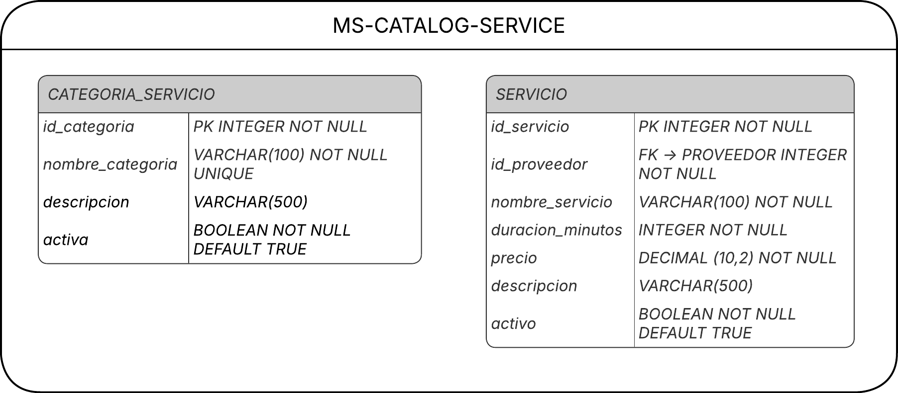

# Plataforma de Reservas de Servicios - MS-Catalog-Service

[](https://github.com/Isa-Bedoya-UdeA/Reservas-MS-Catalog-Service/actions/workflows/build.yml)
[](https://sonarcloud.io/summary/new_code?id=Isa-Bedoya-UdeA_Reservas-MS-Catalog-Service)
[](https://sonarcloud.io/summary/new_code?id=Isa-Bedoya-UdeA_Reservas-MS-Catalog-Service)
[](https://sonarcloud.io/summary/new_code?id=Isa-Bedoya-UdeA_Reservas-MS-Catalog-Service)
[](https://sonarcloud.io/summary/new_code?id=Isa-Bedoya-UdeA_Reservas-MS-Catalog-Service)
[](https://sonarcloud.io/summary/new_code?id=Isa-Bedoya-UdeA_Reservas-MS-Catalog-Service)
[](https://sonarcloud.io/summary/new_code?id=Isa-Bedoya-UdeA_Reservas-MS-Catalog-Service)

## Descripción

CodeF@ctory - Caso 15 - Plataforma de Reservas de Servicios - Microservicio de Catálogo de Servicios.

## Responsabilidad

Gestión de servicios ofrecidos por proveedores

## Tecnologías

### Backend

* **Java 17**
* **Spring Boot 3.5.13**
* **Spring Security** (Autenticación y autorización)
* **Spring Data JPA** (Persistencia)
* **JWT** (JSON Web Tokens para autenticación)
* **MapStruct** (Mapeo entre entidades y DTOs)
* **Lombok** (Reducción de código boilerplate)
* **Maven** (Gestión de dependencias)

### Herramientas de Desarrollo

* **Git** (Control de versiones)
* **GitHub** (Repositorio remoto)
* **Postman** (Pruebas de APIs)
* **SonarCloud** (Análisis de calidad de código)

## Requisitos Previos

Antes de ejecutar el proyecto, asegúrate de tener instalado:

* **JDK 17** o superior
* **Maven 3.8+**
* **Oracle Database** o **PostgreSQL**
* **Git**

## Instalación

### 1. Clonar el Repositorio

```bash
git clone https://github.com/Isa-Bedoya-UdeA/Reservas-MS-Catalog-Service
cd Reservas-MS-Catalog-Service
```

### 2. Configurar la Base de Datos y Propiedades

Copia el archivo `.env.example` a `.env`:

```bash
cp .env.example .env
```

Edita el archivo `.env` con tus credenciales de Supabase:

```bash
# SPRING PROFILE
SPRING_PROFILE=dev

# DATABASE CONFIG - SUPABASE (Transaction Pooler - IPv4 compatible)
DB_URL=jdbc:postgresql://aws-1-us-west-2.pooler.supabase.com:6543/postgres?sslmode=require&prepareThreshold=0
DB_USER=postgres.[TU-PROJECT-REF]
DB_PASSWORD=[TU-CONTRASEÑA-DE-SUPABASE]

# EXTERNAL SERVICES URLs
SERVICES_AUTH_URL=http://localhost:8081
```

### 3. Configurar JWT

Genera un JWT_SECRET seguro:

```bash
openssl rand -base64 64
```

Agrega el JWT_SECRET generado a tu archivo `.env`:

```bash
JWT_SECRET=[TU-JWT-SECRET-SEGURA]
JWT_EXPIRATION=86400000
```

> **IMPORTANTE:** El JWT_SECRET debe ser el mismo en todos los microservicios.

### 4. Compilar el Proyecto

```bash
# Limpia el target y compila
Remove-Item -Recurse -Force target -ErrorAction SilentlyContinue
mvn clean compile
```

### 5. Ejecutar la Aplicación

```bash
mvn spring-boot:run
```

> **IMPORTANTE:** Para el correcto funcionamiento, debes tener corriendo ambos microservicios:
> - Auth Service (puerto 8081)
> - Catalog Service (puerto 8082)

La aplicación estará disponible en: `http://localhost:8082`

## Estructura del Proyecto

```
Reservas-MS-Catalog-Service/
├── src/
│   ├── main/
│   │   ├── java/com/codefactory/reservasmscatalogservice/
│   │   │   ├── client/              # Feign Clients para comunicación entre microservicios
│   │   │   ├── config/              # Configuración de Spring (Security, JWT, etc.)
│   │   │   ├── controller/          # Controladores REST (Category, ServiceOffering, Health)
│   │   │   ├── dto/                 # Data Transfer Objects (Request y Response)
│   │   │   ├── entity/              # Entidades JPA (ServiceCategory, ServiceOffering)
│   │   │   ├── exception/           # Excepciones personalizadas y manejo global
│   │   │   ├── mapper/              # Mapeadores (MapStruct) entre entidades y DTOs
│   │   │   ├── repository/          # Repositorios Spring Data JPA
│   │   │   ├── security/            # Seguridad (JWT filter, user details)
│   │   │   ├── service/             # Interfaces de servicios
│   │   │   └── service/impl/        # Implementaciones de servicios
│   │   └── resources/
│   │       ├── application.properties
│   │       ├── application-dev.properties
│   │       ├── application-prod.properties
│   │       └── application-test.properties
│   └── test/
│       └── java/                    # Tests unitarios y de integración
├── docs/                            # Diagramas y documentación arquitectónica
├── .env.example                     # Plantilla de variables de entorno
├── .env                             # Variables de entorno (no versionado)
├── pom.xml                          # Configuración de Maven
└── README.md
```

## Endpoints Principales

### Health Check
- `GET /api/`: Health Check - Retorna estado del servicio
- `GET /api/version`: Version Check - Retorna versión del servicio

### Categorías
- `GET /api/catalog/categories`: Obtener todas las categorías (público)
- `GET /api/catalog/categories/{id}`: Obtener categoría por ID (público)
- `POST /api/catalog/categories`: Crear nueva categoría (requiere ROLE_ADMIN)
- `PUT /api/catalog/categories/{id}`: Actualizar categoría (requiere ROLE_ADMIN)
- `DELETE /api/catalog/categories/{id}`: Desactivar categoría (requiere ROLE_ADMIN)
- `PATCH /api/catalog/categories/{id}/activate`: Activar categoría (requiere ROLE_ADMIN)

### Servicios Ofertados
- `POST /api/catalog/services`: Crear servicio ofertado (requiere ROLE_PROVEEDOR)

## Relaciones entre Entidades

- **ServiceCategory**: Entidad que representa categorías de servicios (ej: Belleza, Salud, Educación)
- **ServiceOffering**: Entidad que representa servicios específicos ofrecidos por proveedores
- **ServiceOffering** está asociada a una **ServiceCategory** (cada servicio pertenece a una categoría)
- **ServiceOffering** está asociada a un **Provider** (cada servicio es ofrecido por un proveedor específico)

## Diagramas

### Diagrama del Modelo de Dominio
[docs/domain-model.png]
(Pendiente)

### Diagrama de Arquitectura C4
[docs/architecture-c4.png]
(Pendiente)

### Diagrama de Componentes
[docs/components.png]
(Pendiente)

### Diagrama de Secuencia
[docs/sequence.png]
(Pendiente)

### Diagrama MER Lógico


### ADRs (Architecture Decision Records)
[docs/adrs/]
(Pendiente)

### Documentación de API (Swagger/OpenAPI)
[docs/swagger.png]
(Pendiente)

### Variables de Entorno para Despliegue
[docs/environment-variables.md]
(Pendiente)

## Pruebas en Postman

> Importante: El `Content-Type` de las peticiones debe ser `application/json`.

### Obtener Todas las Categorías (Público)

```http
GET http://localhost:8082/api/catalog/categories
```

**Respuesta esperada (200 OK):**
```json
[
    {
        "id": "uuid-categoria-1",
        "nombre": "Belleza",
        "descripcion": "Servicios de belleza y cuidado personal",
        "activo": true
    },
    {
        "id": "uuid-categoria-2",
        "nombre": "Salud",
        "descripcion": "Servicios de salud y bienestar",
        "activo": true
    }
]
```

### Obtener Categoría por ID (Público)

```http
GET http://localhost:8082/api/catalog/categories/0203c0b2-be07-44c0-8d12-bf9c362d10aa
```

**Respuesta esperada (200 OK):**
```json
{
    "id": "0203c0b2-be07-44c0-8d12-bf9c362d10aa",
    "nombre": "Belleza",
    "descripcion": "Servicios de belleza y cuidado personal",
    "activo": true
}
```

### Obtener Categoría No Existente (404)

```http
GET http://localhost:8082/api/catalog/categories/00000000-0000-0000-0000-000000000000
```

**Respuesta esperada (404 Not Found):**
```json
{
    "status": 404,
    "error": "Not Found",
    "message": "Categoría no encontrado con id: 00000000-0000-0000-0000-000000000000"
}
```

### Crear Categoría (Requiere ROLE_ADMIN)

```http
POST http://localhost:8082/api/catalog/categories
Content-Type: application/json
Authorization: Bearer <JWT_TOKEN>

{
    "nombre": "Deportes",
    "descripcion": "Servicios deportivos y fitness"
}
```

**Respuesta esperada (201 Created):**
```json
{
    "id": "uuid-nueva-categoria",
    "nombre": "Deportes",
    "descripcion": "Servicios deportivos y fitness",
    "activo": true
}
```

### Crear Categoría con Datos Inválidos (400)

```http
POST http://localhost:8082/api/catalog/categories
Content-Type: application/json
Authorization: Bearer <JWT_TOKEN>

{
    "nombre": "  ",
    "descripcion": "abc"
}
```

**Respuesta esperada (400 Bad Request):**
```json
{
    "status": 400,
    "error": "Validation Error",
    "message": "Errores de validación en los datos de entrada",
    "validationErrors": {
        "nombre": "El nombre no puede estar vacío",
        "descripcion": "La descripción debe tener al menos 10 caracteres"
    }
}
```

### Actualizar Categoría (Requiere ROLE_ADMIN)

```http
PUT http://localhost:8082/api/catalog/categories/0203c0b2-be07-44c0-8d12-bf9c362d10aa
Content-Type: application/json
Authorization: Bearer <JWT_TOKEN>

{
    "nombre": "Belleza y Cuidado Personal",
    "descripcion": "Servicios profesionales de belleza y cuidado personal"
}
```

**Respuesta esperada (200 OK):**
```json
{
    "id": "0203c0b2-be07-44c0-8d12-bf9c362d10aa",
    "nombre": "Belleza y Cuidado Personal",
    "descripcion": "Servicios profesionales de belleza y cuidado personal",
    "activo": true
}
```

### Desactivar Categoría (Requiere ROLE_ADMIN)

```http
DELETE http://localhost:8082/api/catalog/categories/0203c0b2-be07-44c0-8d12-bf9c362d10aa
Authorization: Bearer <JWT_TOKEN>
```

**Respuesta esperada (204 No Content)**

### Activar Categoría (Requiere ROLE_ADMIN)

```http
PATCH http://localhost:8082/api/catalog/categories/0203c0b2-be07-44c0-8d12-bf9c362d10aa/activate
Authorization: Bearer <JWT_TOKEN>
```

**Respuesta esperada (204 No Content)**

### Crear Servicio Ofertado (Requiere ROLE_PROVEEDOR)

```http
POST http://localhost:8082/api/catalog/services?idProveedor=uuid-proveedor
Content-Type: application/json
Authorization: Bearer <JWT_TOKEN>

{
    "nombre": "Corte de Cabello",
    "descripcion": "Corte de cabello profesional",
    "duracionMinutos": 30,
    "precio": 25000,
    "idCategoria": "uuid-categoria"
}
```

**Respuesta esperada (201 Created):**
```json
{
    "id": "uuid-nuevo-servicio",
    "nombre": "Corte de Cabello",
    "descripcion": "Corte de cabello profesional",
    "duracionMinutos": 30,
    "precio": 25000,
    "activo": true
}